# 小胡养基 (XiaoHuYangJi)

本地优先、隐私至上的基金管理应用，帮助用户聚合管理基金持仓、查看收益分析。

[Github Pages 在线演示](https://gp.hrfuqiang.top/fund-manager/)

<details>
<summary>桌面端界面展示</summary>

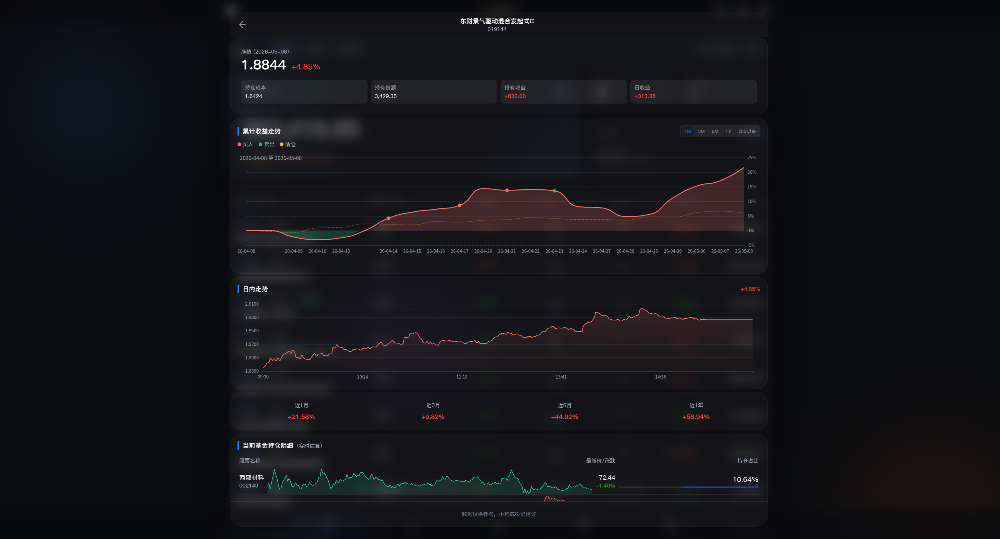
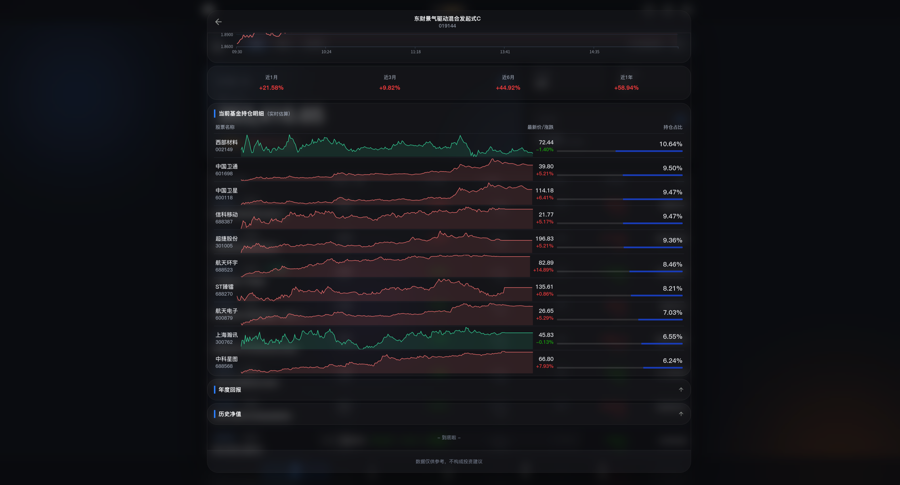
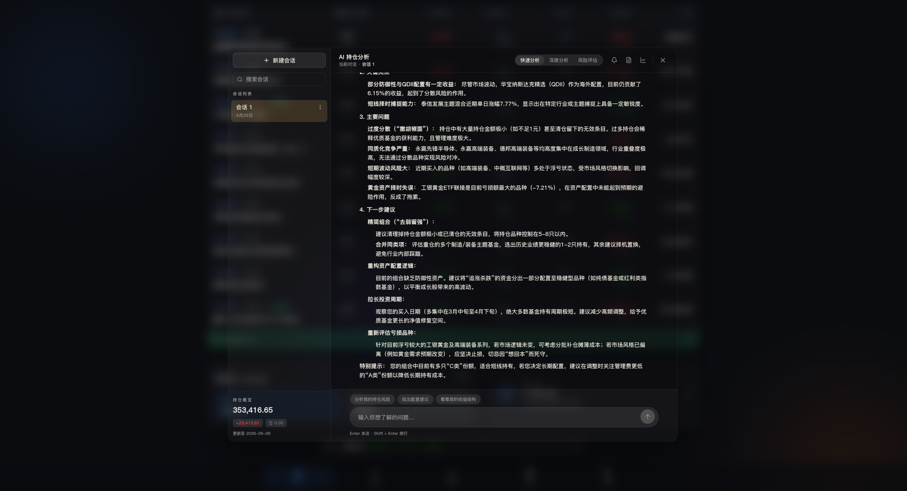


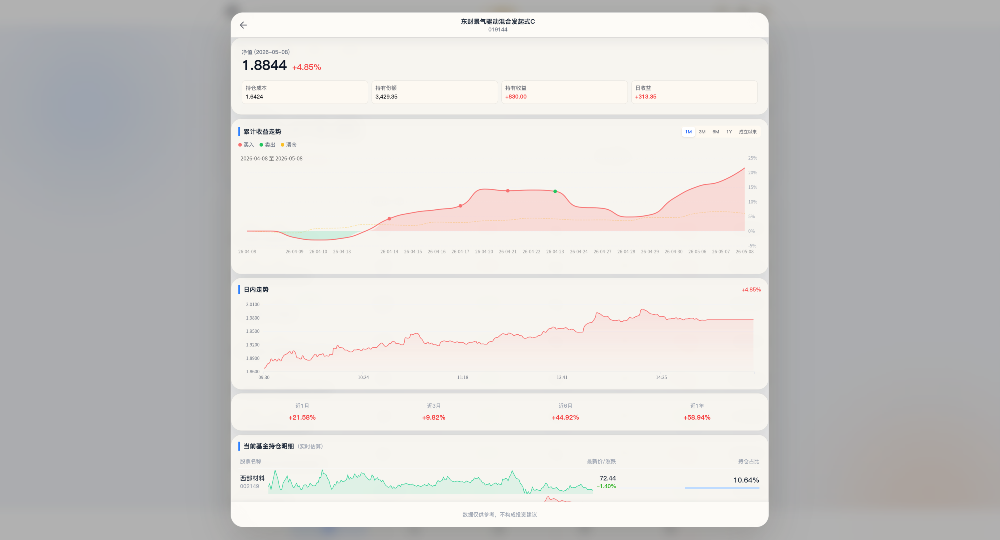
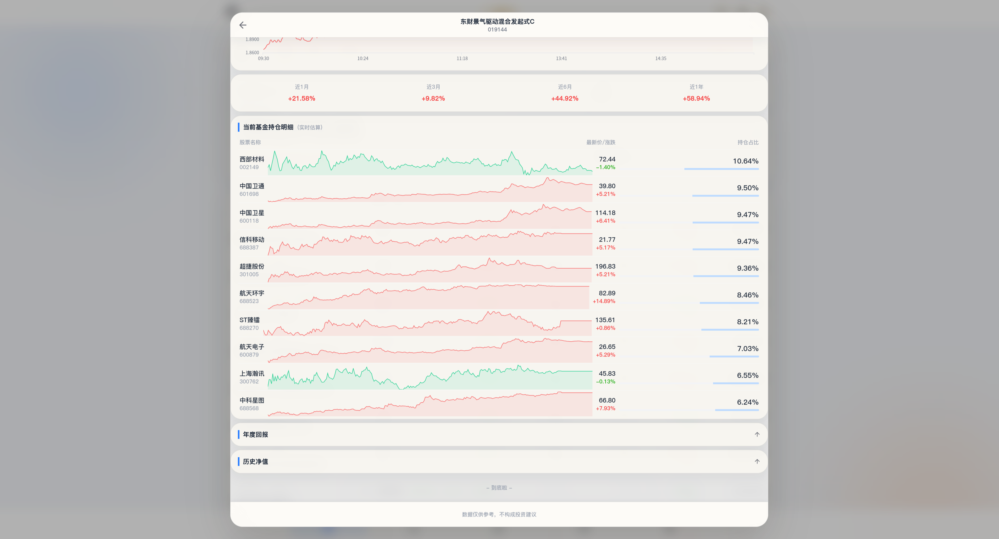
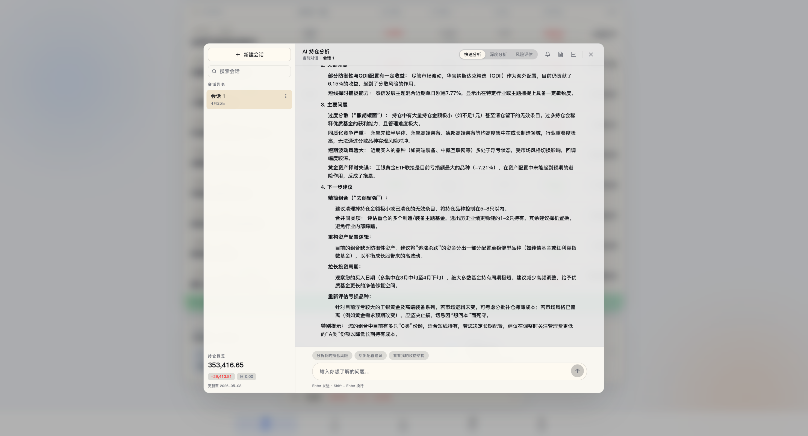
</details>

<details>
<summary>移动端界面展示</summary>

<div style="display: flex; gap: 8px; justify-content: center; flex-wrap: wrap;">
  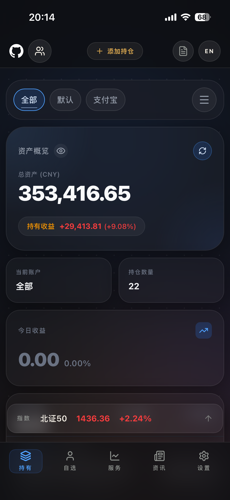
  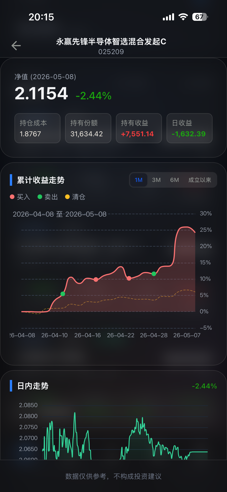
  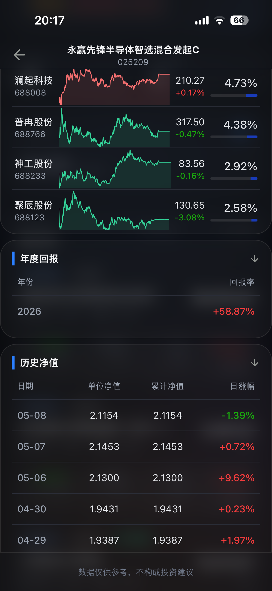
  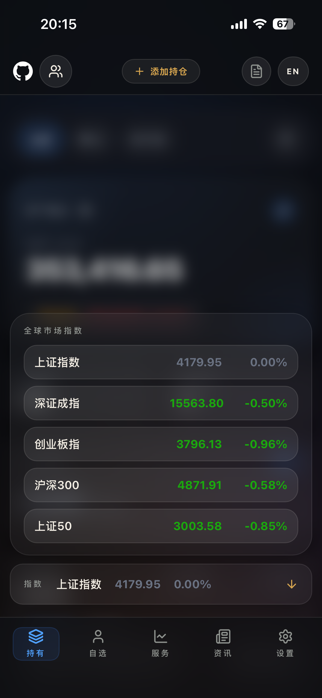
</div>

<div style="display: flex; gap: 8px; justify-content: center; flex-wrap: wrap; margin-top: 8px;">
  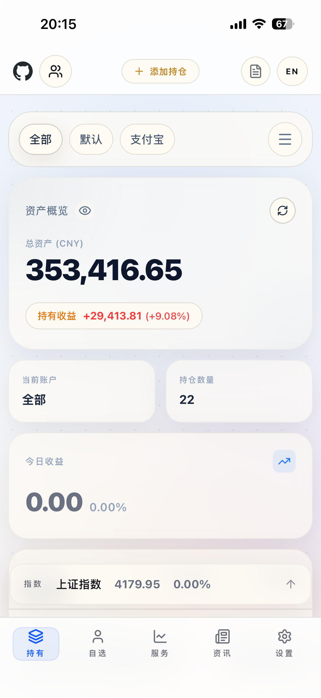
  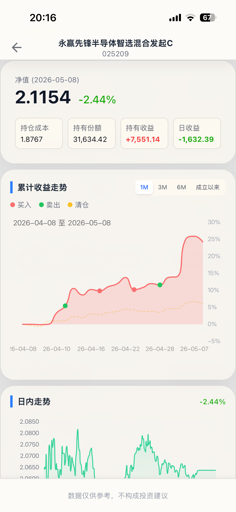
  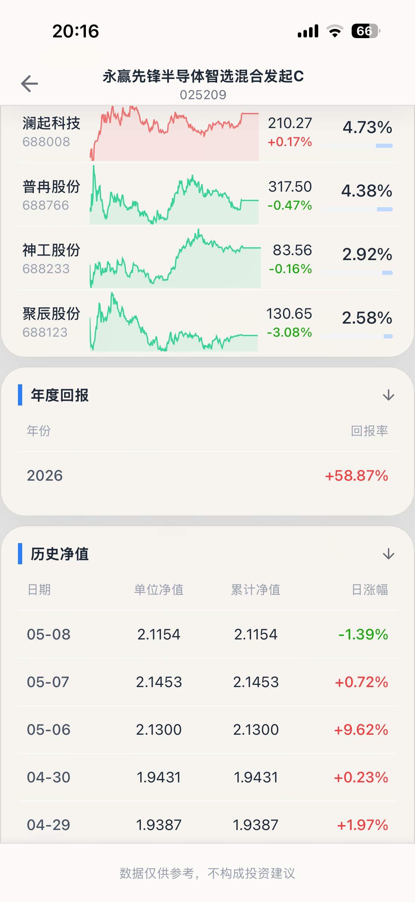
  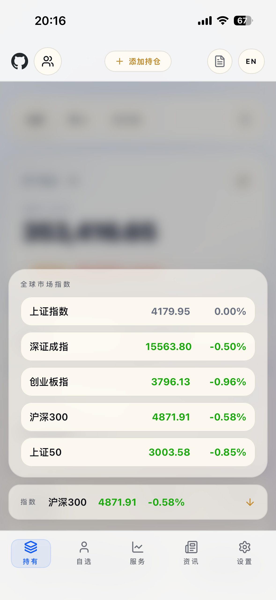
</div>
</details>

## 功能特性

- **基金管理**：支持添加、编辑、删除基金持仓记录
- **自选概览**：支持将基金和市场指数（沪深等）加入自选列表，并根据自定义锚点计算收益差距
- **实时估值**：交易日 9:20 后自动拉取前十大持仓股票实时报价，精准预估当日涨跌；支持 QDII/港股/ETF 基金通过跟踪指数实时行情进行估值
- **多资产/多平台支持**：支持多账户管理，多平台分类过滤与统计
- **灵活的详情页**：支持多时间维度的业绩走势图（ECharts），含时间段起点归零对比、红涨绿跌分段着色、交易标记与成本锚点；历史净值表格与持仓明细展示
- **动态大盘**：底部滚动展示当前核心市场指数行情
- **智能交互**：支持模拟图像识别导入（ScannerModal）、响应式设计（支持深色模式与国际化）
- **AI 持仓分析**：支持多轮对话分析、快速/深度/风险三种模式、左侧会话列表 + 右侧聊天区布局、常用问题模板、资产配置/收益对比可视化、会话导出与本地缓存
- **流畅体验**：全站应用 Framer Motion 非线性弹性动画
- **本地优先**：数据完全存储于本地 IndexedDB，保障隐私安全

## 技术栈

| 分类     | 技术                  |
| -------- | --------------------- |
| 框架     | React 19 + TypeScript |
| 构建     | Vite 6                |
| 样式     | Tailwind CSS v4       |
| 图表     | ECharts 5             |
| 动画     | Framer Motion         |
| 本地存储 | Dexie（IndexedDB）    |
| 图标     | Lucide React          |
| 部署     | GitHub Pages（自动）  |

## 本地开发

**前置条件**：Node.js >= 18

```bash
# 安装依赖
npm install

# 启动开发服务器（默认 http://localhost:3000）
npm run dev
```

如需使用 Gemini / DeepSeek API 功能（如提交翻译），请在项目根目录创建 `.env.local` 文件：

```env
GEMINI_API_KEY=your_gemini_api_key_here
DEEPSEEK_API_KEY=your_deepseek_api_key_here
```

构建时提交信息翻译优先使用 Gemini，失败或未配置时自动回退到 DeepSeek，两者都不可用时跳过翻译。

## 构建与预览

```bash
# 构建生产版本
npm run build

# 本地预览构建结果
npm run preview
```

## AI 持仓分析使用说明

1. 在设置中配置可用的 OpenAI / Gemini / DeepSeek / OpenAI Compatible 接口。
2. 在首页点击“AI 持仓分析”进入分析面板。
3. 桌面端采用双栏布局：
   - 左侧为会话列表、搜索与新建会话；
   - 右侧为分析模式、快捷问题、聊天记录、可视化卡片与输入区。
4. 支持三种分析模式：
   - **快速分析**：适合快速看结论；
   - **深度分析**：适合查看收益结构、集中度与改进建议；
   - **风险评估**：适合排查仓位风险、单行业暴露与组合脆弱点。
5. 支持本地缓存相同问题结果，减少重复调用；支持导出当前会话为 JSON / Markdown。
6. 可开启定期提醒（每日 / 每周 / 每月），在浏览器允许通知后收到分析提醒。

## 部署

项目已配置 GitHub Actions，推送到 `main` 或 `v2` 分支后会自动构建并部署到 GitHub Pages。

默认会根据仓库名自动推导 Vite `base` 路径：

- 用户主页仓库（`<owner>.github.io`）→ `/`
- 项目仓库（普通仓库）→ `/<repo-name>/`

如需手动覆盖，可在 **Settings → Secrets and variables → Actions → Variables** 配置：

- `PAGES_BASE_PATH`：自定义 base（例如 `/` 或 `/my-app/`）
- `PAGES_CNAME`：可选，自定义域名（例如 `example.com`）

### 首次启用 GitHub Pages

1. 进入 GitHub 仓库 **Settings → Pages**
2. **Source** 选择 **GitHub Actions**
3. 推送代码到 `main` 或 `v2` 分支即可触发部署

## Telegram/QQ 定时分析 Worker

项目包含一个 Cloudflare Worker（`workers/telegram-ai-reminder/`），用于定时拉取 Gist 持仓备份、采集市场/新闻/资金流数据，并通过 AI 生成分析报告，推送到 Telegram 或 QQ 群。

定时任务（北京时间工作日）：

- **11:35** — 午盘休息分析
- **14:30** — 尾盘操作提醒
- **15:00** — 收盘分析

支持 Telegram Bot 命令（`/分析`、`/详细分析`、`/建仓`、`/加仓`、`/减仓`、`/清仓`）以及 QQ 官方机器人 / OneBot 群消息触发。

### Worker 环境变量

密钥类变量请使用 `wrangler secret put` 设置，非敏感变量可在 `wrangler.toml` 的 `[vars]` 中配置。

#### Telegram 通道

| 变量名                    | 类型           | 必填 | 默认值 | 说明                                                                              |
| ------------------------- | -------------- | ---- | ------ | --------------------------------------------------------------------------------- |
| `TELEGRAM_BOT_TOKEN`      | string         | 是   | —      | Telegram Bot Token，用于发送消息与设置 Webhook                                    |
| `TELEGRAM_CHAT_ID`        | string         | 是   | —      | 接收分析消息的 Telegram Chat ID                                                   |
| `TELEGRAM_WEBHOOK_SECRET` | string（可选） | 否   | —      | Webhook 验证密钥，设置后仅接受携带匹配 `X-Telegram-Bot-Api-Secret-Token` 头的请求 |

#### AI 分析

| 变量名        | 类型                                                                 | 必填     | 默认值             | 说明                                                                  |
| ------------- | -------------------------------------------------------------------- | -------- | ------------------ | --------------------------------------------------------------------- |
| `AI_PROVIDER` | `"openai"` \| `"gemini"` \| `"deepseek"` \| `"customOpenAi"`（可选） | 否       | `"customOpenAi"`   | AI 服务提供商；为 `"customOpenAi"` 时需同时配置 `AI_BASE_URL`         |
| `AI_API_KEY`  | string                                                               | 是       | —                  | AI 服务 API 密钥                                                      |
| `AI_MODEL`    | string                                                               | 是       | —                  | AI 模型名称（如 `gpt-4o`、`gemini-2.5-flash`、`deepseek-chat`）       |
| `AI_BASE_URL` | string（可选）                                                       | 条件必填 | —                  | 自定义 OpenAI 兼容 API 地址；`AI_PROVIDER` 为 `"customOpenAi"` 时必填 |
| `AI_MODE`     | `"quick"` \| `"deep"` \| `"risk"`（可选）                            | 否       | `"deep"`           | 分析模式：快速诊断 / 深度分析 / 风险评估                              |
| `AI_QUESTION` | string（可选）                                                       | 否       | 综合持仓分析提示词 | 自定义分析问题，覆盖默认的综合分析提示词                              |

#### 数据源

| 变量名          | 类型           | 必填 | 默认值                     | 说明                                                                  |
| --------------- | -------------- | ---- | -------------------------- | --------------------------------------------------------------------- |
| `GITHUB_TOKEN`  | string         | 是   | —                          | GitHub Personal Access Token（需 `gist` 权限），用于读取持仓备份 Gist |
| `GIST_ID`       | string         | 是   | —                          | 存储 `fund-manager-sync.json` 备份的 Gist ID                          |
| `GIST_FILENAME` | string（可选） | 否   | `"fund-manager-sync.json"` | Gist 中备份文件的文件名                                               |

#### 市场 / 新闻

| 变量名                    | 类型                                           | 必填 | 默认值                                                                      | 说明                                                                                         |
| ------------------------- | ---------------------------------------------- | ---- | --------------------------------------------------------------------------- | -------------------------------------------------------------------------------------------- |
| `MARKET_ANALYSIS_ENABLED` | string（可选）                                 | 否   | `"true"`                                                                    | 是否启用 A 股市场指数采集；设为 `"false"` 关闭                                               |
| `MARKET_INDEX_CODES`      | string（可选）                                 | 否   | `"sh000001,sz399001,sz399006,sh000300,sh000016,sh000905,sh000852,sh000688"` | 腾讯财经指数代码，逗号分隔（上证、深证、创业板、沪深300、上证50、中证500、中证1000、科创50） |
| `NEWS_ANALYSIS_ENABLED`   | string（可选）                                 | 否   | `"true"`                                                                    | 是否启用财经新闻采集；设为 `"false"` 关闭                                                    |
| `NEWS_PROVIDER`           | `"eastmoney"` \| `"sina"` \| `"mixed"`（可选） | 否   | `"mixed"`                                                                   | 新闻数据源：仅东方财富 / 仅新浪 / 两者混合                                                   |
| `NEWS_LOOKBACK_HOURS`     | string（可选）                                 | 否   | `"72"`                                                                      | 新闻回溯时长（小时），超出窗口的新闻会被过滤                                                 |
| `NEWS_MAX_ITEMS`          | string（可选）                                 | 否   | `"12"`                                                                      | 单次抓取最大新闻条数（源码上限 25）                                                          |
| `NEWS_QUERY_TIMEOUT_MS`   | string（可选）                                 | 否   | `"5000"`                                                                    | 单次新闻查询超时（毫秒），源码上限 10000                                                     |

#### QQ 官方机器人

| 变量名                               | 类型           | 必填     | 默认值         | 说明                                                                           |
| ------------------------------------ | -------------- | -------- | -------------- | ------------------------------------------------------------------------------ |
| `QQ_OFFICIAL_ENABLED`                | string（可选） | 否       | `"false"`      | 是否启用 QQ 官方机器人 Webhook（`/qq-official`）                               |
| `QQ_OFFICIAL_APP_ID`                 | string（可选） | 条件必填 | `"1903963785"` | QQ 官方机器人 App ID；启用时必填                                               |
| `QQ_OFFICIAL_APP_SECRET`             | string（可选） | 条件必填 | —              | QQ 官方机器人 App Secret；启用时必填，用于 Ed25519 签名验证和获取 Access Token |
| `QQ_OFFICIAL_ALLOWED_GROUP_OPENIDS`  | string（可选） | 否       | —              | 允许响应的群 OpenID 列表，逗号分隔；为空时所有群均可触发                       |
| `QQ_OFFICIAL_ALLOWED_MEMBER_OPENIDS` | string（可选） | 否       | —              | 允许响应的成员 OpenID 列表，逗号分隔；为空时所有成员均可触发                   |

#### QQ OneBot

| 变量名                 | 类型           | 必填     | 默认值   | 说明                                                           |
| ---------------------- | -------------- | -------- | -------- | -------------------------------------------------------------- |
| `QQ_BOT_ENABLED`       | string（可选） | 否       | `"true"` | 是否启用 QQ OneBot Webhook（`/qq`）；设为 `"false"` 关闭       |
| `QQ_BOT_API_BASE`      | string（可选） | 条件必填 | —        | OneBot API 基础地址（如 `http://127.0.0.1:5700`）；启用时必填  |
| `QQ_BOT_ACCESS_TOKEN`  | string（可选） | 否       | —        | OneBot Access Token，设置后通过 `Authorization: Bearer` 头传递 |
| `QQ_ALLOWED_GROUP_IDS` | string（可选） | 否       | —        | 允许响应的群号列表，逗号分隔；为空时所有群均可触发             |
| `QQ_ALLOWED_USER_IDS`  | string（可选） | 否       | —        | 允许响应的用户 QQ 号列表，逗号分隔；为空时所有用户均可触发     |

#### 安全

| 变量名        | 类型           | 必填 | 默认值 | 说明                                                                                      |
| ------------- | -------------- | ---- | ------ | ----------------------------------------------------------------------------------------- |
| `CRON_SECRET` | string（可选） | 否   | —      | 手动触发端点（`/run`、`/setup-telegram-webhook`）的 Bearer Token 鉴权密钥；未设置时不校验 |

## 添加到手机桌面（推荐）

小胡养基支持 PWA，可添加到手机桌面获得类原生 App 体验：全屏运行、独立应用图标、无浏览器地址栏干扰。

### iOS（Safari）

1. 用 **Safari** 打开 `https://gp.hrfuqiang.top/fund-manager/`
2. 点击底部工具栏中间的 **分享** 按钮（方框箭头图标）
3. 在分享菜单中滑动找到 **「添加到主屏幕」**（Add to Home Screen）
4. 确认应用名称后点击右上角 **「添加」**
5. 桌面即出现小胡养基图标，点击即可全屏启动

> **提示**：iOS 添加的 PWA 支持灵动岛/安全区域自适应，且可独立切换深色/浅色模式。

### Android（Chrome / Edge）

1. 用 Chrome 或 Edge 打开 `https://gp.hrfuqiang.top/fund-manager/`
2. 点击地址栏右侧或底部菜单中的 **⋮** → **「添加到主屏幕」** 或 **「安装应用」**
3. 按提示确认即可

## 项目结构

```
fund-manager/
├── .github/workflows/  # CI/CD 配置
│   └── deploy.yml      # GitHub Pages 部署工作流
├── components/         # React 组件
│   ├── Dashboard.tsx   # 主面板（持仓概览）
│   ├── Watchlist.tsx   # 自选功能页
│   ├── FundDetail.tsx  # 基金详情页
│   ├── AddFundModal.tsx# 添加或编辑弹窗
│   ├── Header.tsx      # 顶部导航栏
│   ├── BottomNav.tsx   # 底部导航栏
│   └── ...
├── services/           # 业务逻辑
│   ├── api.ts          # 数据接口服务（晨星/东方财富/腾讯API）
│   ├── db.ts           # Dexie 本地数据库（包含资金结算逻辑）
│   ├── financeUtils.ts # 金融数据格式计算
│   └── i18n.tsx        # 国际化上下文
├── App.tsx             # 应用根组件
├── index.tsx           # 入口文件
├── index.html          # HTML 模板
├── app.css             # Tailwind CSS 入口
├── types.ts            # TypeScript 类型定义
├── vite.config.ts      # Vite 配置
├── tsconfig.json       # TypeScript 配置
└── package.json        # 项目配置
```

## TODO (后续计划)

- [x] 增加 ETF 实时估值功能
- [x] 增加美股、港股相关基金的估值功能
- [ ] 优化 bundle 大小(考虑代码分割)
- [ ] 清理 ESLint 警告

## License

[GPL-3.0 License](./LICENSE)

## 社区

感谢 [linux.do](https://linux.do) ——一个充满活力的中国科技社区，你可以在这里学习人工智能、开发及更多内容。
