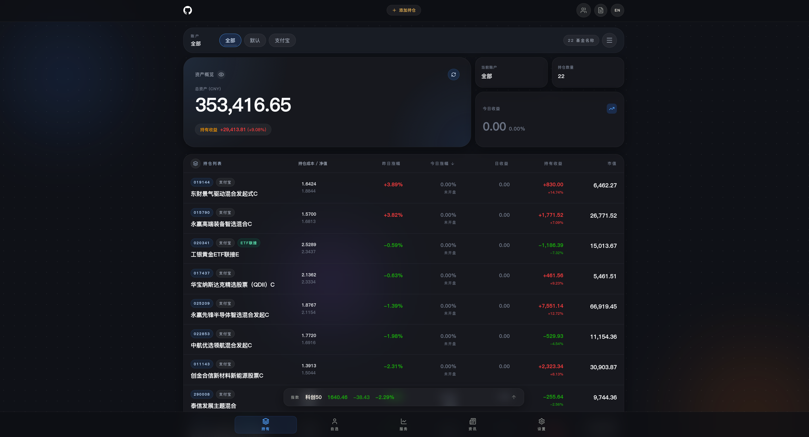
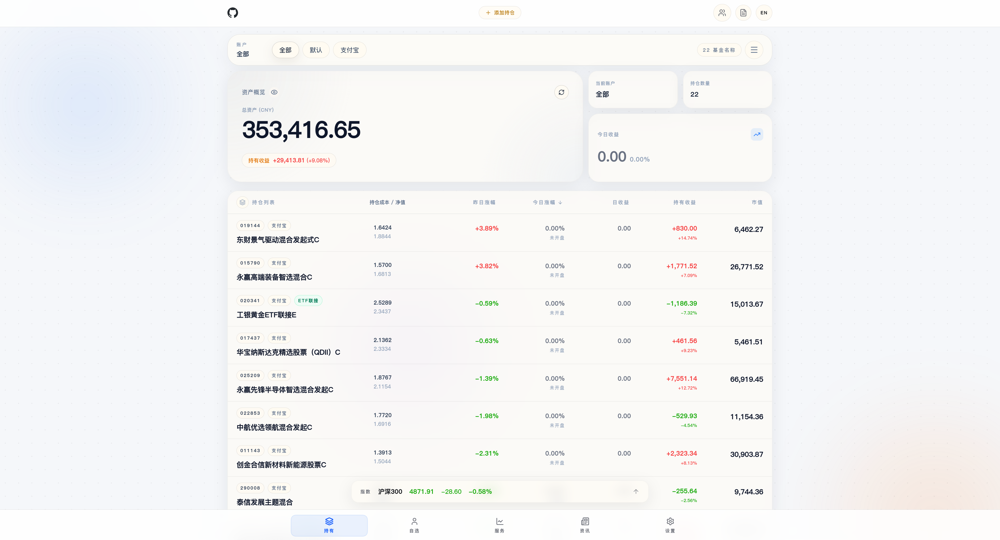

# 小胡养基 (XiaoHuYangJi)

本地优先、隐私至上的基金管理应用，帮助用户聚合管理基金持仓、查看收益分析。

<p align="center">
  
  
</p>

## 功能特性

- **基金管理**：支持添加、编辑、删除基金持仓记录
- **自选概览**：支持将基金和市场指数（沪深等）加入自选列表，并根据自定义锚点计算收益差距
- **实时估值**：交易日 9:20 后自动拉取前十大持仓股票实时报价，精准预估当日涨跌
- **多资产/多平台支持**：支持多账户管理，多平台分类过滤与统计
- **灵活的详情页**：支持多时间维度的业绩走势图（ECharts）、历史净值表格与持仓明细展示
- **动态大盘**：底部滚动展示当前核心市场指数行情
- **智能交互**：支持模拟图像识别导入（ScannerModal）、响应式设计（支持深色模式与国际化）
- **流畅体验**：全站应用 Framer Motion 非线性弹性动画
- **本地优先**：数据完全存储于本地 IndexedDB，保障隐私安全

## 技术栈

| 分类     | 技术                  |
| -------- | --------------------- |
| 框架     | React 19 + TypeScript |
| 构建     | Vite 6                |
| 样式     | Tailwind CSS v4       |
| 图表     | ECharts 5             |
| 动画     | Framer Motion         |
| 本地存储 | Dexie（IndexedDB）    |
| 图标     | Lucide React          |
| 部署     | GitHub Pages（自动）  |

## 本地开发

**前置条件**：Node.js >= 18

```bash
# 安装依赖
npm install

# 启动开发服务器（默认 http://localhost:3000）
npm run dev
```

如需使用 Gemini API 功能，请在项目根目录创建 `.env.local` 文件：

```env
GEMINI_API_KEY=your_api_key_here
```

## 构建与预览

```bash
# 构建生产版本
npm run build

# 本地预览构建结果
npm run preview
```

## 部署

项目已配置 GitHub Actions，推送到 `main` 分支后自动构建部署至 GitHub Pages。

### 首次启用 GitHub Pages

1. 进入 GitHub 仓库 **Settings → Pages**
2. **Source** 选择 **GitHub Actions**
3. 推送代码到 `main` 分支即可触发部署

## 项目结构

```
fund-manager/
├── .github/workflows/  # CI/CD 配置
│   └── deploy.yml      # GitHub Pages 部署工作流
├── components/         # React 组件
│   ├── Dashboard.tsx   # 主面板（持仓概览）
│   ├── Watchlist.tsx   # 自选功能页
│   ├── FundDetail.tsx  # 基金详情页
│   ├── AddFundModal.tsx# 添加或编辑弹窗
│   ├── Header.tsx      # 顶部导航栏
│   ├── BottomNav.tsx   # 底部导航栏
│   └── ...
├── services/           # 业务逻辑
│   ├── api.ts          # 数据接口服务（晨星/东方财富/腾讯API）
│   ├── db.ts           # Dexie 本地数据库（包含资金结算逻辑）
│   ├── financeUtils.ts # 金融数据格式计算
│   └── i18n.tsx        # 国际化上下文
├── App.tsx             # 应用根组件
├── index.tsx           # 入口文件
├── index.html          # HTML 模板
├── app.css             # Tailwind CSS 入口
├── types.ts            # TypeScript 类型定义
├── vite.config.ts      # Vite 配置
├── tsconfig.json       # TypeScript 配置
└── package.json        # 项目配置
```

## TODO (后续计划)

- [ ] 增加 ETF 实时估值功能
- [ ] 增加美股、港股相关基金的估值功能

## License

[GPL-3.0 License](./LICENSE)
